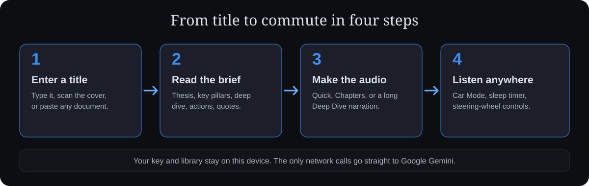

<p align="center"></p>

# BRVTY — Book Intelligence

Turn any book into a structured summary and a commute-ready audio experience. BRVTY is a single-file PWA by [LAZLAB Creations](https://brvty.net). It runs on your own free Google Gemini key, keeps everything on your device, and needs no account.

## Live URLs

| | |
|---|---|
| App | https://app.brvty.net |
| Landing page | https://brvty.net (separate repo: `brvty-landing`) |

## How it works



## What you get

- **Book summaries:** thesis, 4 key pillars, deep dive, action items and quotes, with cover art.
- **Chapter audio:** one track per section, with auto-advance and steering-wheel controls.
- **Quick and Deep Dive audio:** a 3–4 minute brief, or a long audiobook-style narration.
- **Document mode:** paste an article, report or notes and summarize it or read it aloud.
- **Audiobook shelf:** import your own MP3, M4A, WAV or FLAC files into the same player.
- **Smart library:** search, sort and filter; notes and bookmarks per book.
- **Car Mode and sleep timer** for the drive.
- **Vault:** export and import your whole library as one `.folio` file.

## First run

1. Open the app and follow the **Start here** card on the Generate screen (or the intro).
2. Create a key in [Google AI Studio](https://aistudio.google.com/apikey), paste it, and tap **Save & test key**.
3. Enter a book title and tap Generate.

## AI and model setup

BRVTY uses Google Gemini only.

- Defaults: `gemini-3.7-flash` for summaries and `gemini-3.1-flash-tts-preview` for audio (voices Aoede, Orus, Charon, Kore).
- Saving your key fetches the models your key can use. **Settings → Models → Refresh model list** repeats that any time.
- Defaults and your saved choices are never changed automatically. If a chosen model disappears from Google's list, it stays selected and is flagged "(not in current list)".

## Data and privacy

Your key, library, audio and notes live in your browser storage (localStorage and IndexedDB). Nothing is sent anywhere except direct calls to Google's Gemini API and cover lookups (Open Library, iTunes). Export a vault backup regularly: clearing browser data deletes the library.

## Repo layout

```
index.html        the whole app (HTML, CSS, JS)
manifest.json     PWA manifest (scope "/")
sw.js             service worker, versioned from index.html
offline.html      shown when offline and nothing is cached
icon-192.png  icon-512.png  icon-180.png
shot-*.png        install-dialog screenshots
brvty-library.folio   library backup loaded by the logo shortcut (see below)
icon-maskable-512.png padded icon for Android adaptive masks
docs/             README visuals
```

## Loading your library backup

Tap the BRVTY logo 5 times quickly and the app loads `brvty-library.folio` from the site and merges it into your library (books already present are skipped).

The file in this repo is your library backup (14 books, exported 2026-05-09). To refresh it with a newer library: in the app go to **Settings → Library Vault → Export Vault**, save the `.folio` file here as `brvty-library.folio` (replacing the old one), then deploy. It is about 24 MB, so it loads slowly on mobile data, and the service worker never caches it.

## Deploy and update

Hosted on GitHub Pages at app.brvty.net, served from the repo root. To ship a change:

1. Edit `index.html`.
2. Bump `APP_VERSION` in `index.html`. That one value drives the version shown in the app, the title and the service-worker cache name (`brvty-v<version>`).
3. Commit and push. Installed copies show an **update ready** banner on next open.

Moving files or changing `scope` can break existing installs, so keep the app at the repo root.

## Changelog

- **6.3:** new black-and-silver icon; wordmark underlines only "TY" to match it; library backup restored.
- **6.2:** service worker now registers at the real root path (offline works); network-first pages with an update banner; first-run key card with key testing; model picker with refresh; square maskable icons and valid screenshots; contrast, zoom and label fixes; library file loader fixed with a placeholder; single `APP_VERSION`.
- **6.1:** Gemini model update, cover-scan, library vault.

---

© 2026 LAZLAB Creations. All Rights Reserved. · lazlab.io@gmail.com
